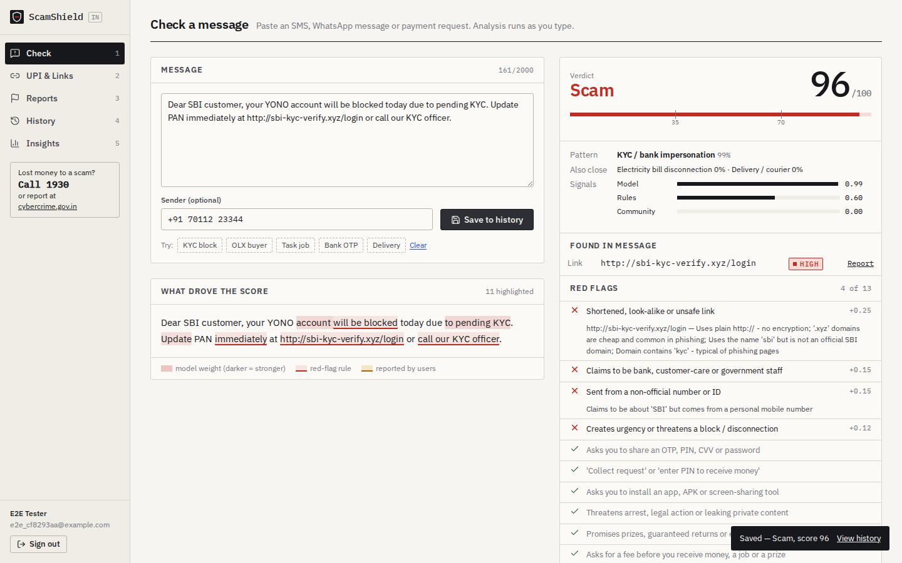
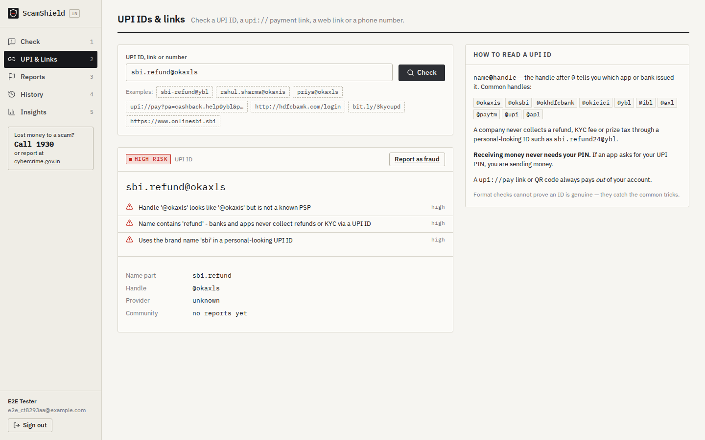
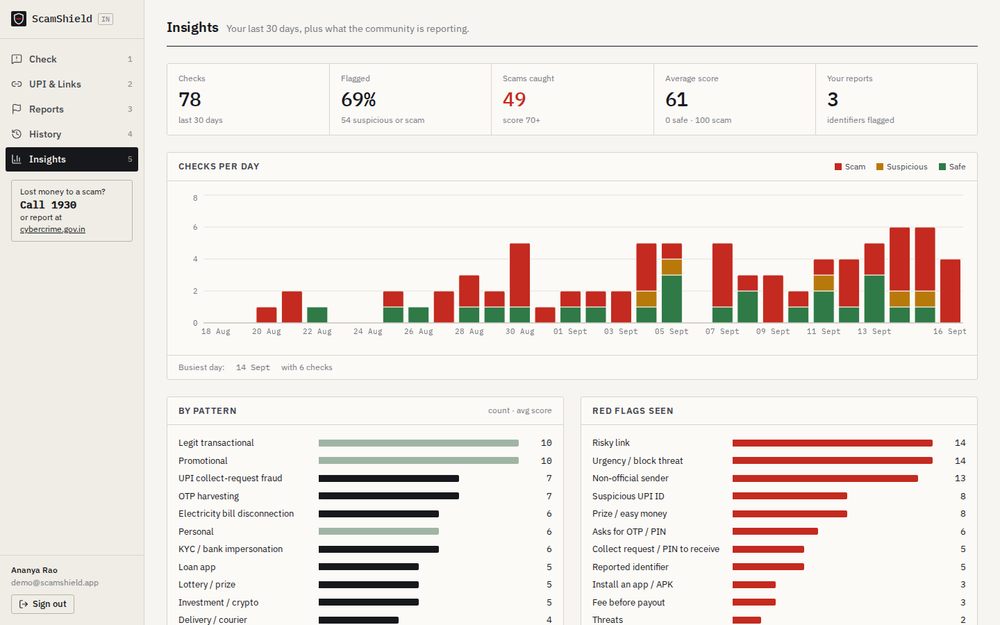

# ScamShield

ScamShield checks a suspicious SMS, WhatsApp message or UPI payment request before you act on it. It is built for Indian users.

Paste a message and it gives you:
- a **0–100 risk score**
- a verdict: **Safe / Suspicious / Scam**
- the **scam pattern** (KYC fraud, UPI collect request, fake job, and so on)
- the **phrases that drove the score**, highlighted in the message
- a **red-flag checklist**
- plain **"what to do" advice**, including the national cyber-fraud helpline **1930** and **cybercrime.gov.in**

It also has:
- a UPI ID / `upi://` link / URL checker
- community fraud reports
- a history and insights dashboard

Stack: **React (Vite, TypeScript) · FastAPI · MongoDB · scikit-learn**



| UPI & link checker | Insights |
|---|---|
|  |  |

---

## Features

1. **Message check** (the first screen after login)
   - Analysis runs live as you type (debounced 400 ms). Stale responses are discarded.
   - "Save to history" stores the result.
   - The optional sender ID is checked against the DLT header format (`VM-HDFCBK`). A personal mobile number that claims to be a bank is flagged.
   - Highlights come in three layers:
     - model token weights (red tint, darker = stronger)
     - rule hits (red underline)
     - identifiers reported by other users (amber)
2. **UPI & link checker**
   - **UPI IDs:** format check, known PSP handles (`okaxis`, `ybl`, `paytm`, …), look-alike handles by edit distance (`@okaxls`), bait words (`refund`, `kyc`, `support`, `customercare`…) and brand names inside personal IDs.
   - **URLs:** shorteners, raw IPs, punycode, look-alike bank/brand domains (edit distance ≤ 2), brand names on unofficial domains, suspicious TLDs, plain `http`, `.apk` downloads.
   - **`upi://pay` links:** parsed into payee, amount and note. The checker warns that such a link always pays *out* of your account.
3. **Community reports**
   - A logged-in user can report a phone number, UPI ID or URL. Values are normalised first (`+91 98765-43210` → `9876543210`).
   - A **unique compound index** `(user_id, kind, value)` stops duplicate reports, so a count of reports is a count of distinct users.
   - Reports raise the risk score of any message that contains the identifier.
4. **History & insights**
   - History uses cursor pagination (by `_id`) and can be filtered by verdict, category and text. Each row expands to show the highlighted analysis.
   - The insights page is built from one `$facet` aggregation:
     - checks per day (IST, dense 30-day series)
     - breakdown by pattern
     - share flagged
     - red-flag frequency
   - It also shows the globally most-reported identifiers and a model card.

---

## Architecture

```
 Browser (React + Vite)                         FastAPI (uvicorn :8001)                      MongoDB
 ┌───────────────────────┐   /api/* (proxy)   ┌──────────────────────────────────────┐   ┌──────────────┐
 │ Check  UPI&Links      │ ─────────────────▶ │ routers/ check  lookup  reports      │──▶│ users        │
 │ Reports History       │   JWT bearer       │          insights  auth              │   │ checks       │
 │ Insights (recharts)   │ ◀───────────────── │ services/                            │   │ reports      │
 └───────────────────────┘                    │   identifiers  (regex extract+norm)  │   └──────────────┘
                                              │   rules        (red-flag checklist)  │
                                              │   upi / urls   (identifier analysis) │
                                              │   classifier   (joblib model, spans) │◀── models/scamshield.joblib
                                              │   analyzer     (score fusion)        │     (trained by ml/train.py)
                                              │   community    (report aggregation)  │
                                              └──────────────────────────────────────┘
```

What happens on `POST /api/check/analyze`:
1. A cheap regex pass extracts identifiers.
2. One aggregation fetches report counts for those identifiers.
3. `analyze()` runs in a threadpool (model + rules).
4. The response returns the score, spans, flags and advice.

The model is loaded once, in the FastAPI lifespan.

---

## ML approach

### Data (`backend/ml/generate_dataset.py`, `ml/templates.py`)
- **Synthetic Indian corpus.** There are 13 categories:
  - 10 scam types
  - 3 safe types: legit transactional, promotional, personal
- The corpus has ~200 hand-written templates, in English and Hinglish.
- Slot fillers vary the content:
  - 12 banks, names, companies, couriers, DISCOMs
  - amounts in many formats, account masks, OTPs, AWBs
  - phone formats, scam URLs (shorteners, IPs, brand-lookalike hosts on cheap TLDs), UPI IDs, `upi://` links, Telegram links
- Noise is added on top: typos (deletions, swaps, keyboard neighbours), all-caps or lower-case, `u`/`ur`/`pls`, repeated punctuation.
- Safe messages deliberately include **hard negatives**: real bank OTPs ("do not share"), debit alerts, refunds, KYC-updated confirmations and cashback promos.
- **UCI SMS Spam Collection** (downloaded successfully during the build):
  - 1,600 ham messages are used as `personal`.
  - 241 spam messages that mention prizes or claims are used as `lottery_prize`.
  - The other UCI spam (UK ringtone/chat promos) is dropped because it doesn't fit the taxonomy.
  - If the download fails, the script continues with synthetic data only and says so.
- **Honest split:**
  - Every template whose index is `i % 4 == 3` is **held out**. It appears only in the test set, so the test set contains wordings the model has never seen.
  - UCI rows are split randomly 80/20.
- Totals: 10,465 messages (8,177 train / 2,288 test).

### Model (`backend/ml/train.py`)
- **Features:** a `FeatureUnion` of two parts. Together they give 31,869 features.
  - TF-IDF **word 1–2-grams** (12k features)
  - TF-IDF **char_wb 3–5-grams** (20k features)

  A length-preserving normaliser runs first. It lower-cases the text and turns every digit into `0`, so offsets still point into the original message.
- **(a) Scam vs not:** `LogisticRegression(class_weight="balanced")` wrapped in `CalibratedClassifierCV(method="sigmoid", cv=3)`.
- **(b) Category:** multinomial `LogisticRegression` over 13 classes.
- The shipped model is refit on all data after evaluation. It is saved with joblib (`models/scamshield.joblib`, **3.2 MB**). Large `stop_words_` attributes are stripped to keep the file small.

### Metrics — held-out templates (`models/metrics.json`)

| Scam vs not (model only) | Precision | Recall | F1 | ROC-AUC |
|---|---|---|---|---|
| All held-out (2,288) | **0.971** | **0.991** | **0.981** | 0.999 |
| Synthetic unseen templates (1,947) | 0.970 | 0.990 | 0.980 | 0.998 |
| UCI SMS test rows (341) | 0.980 | 1.000 | 0.990 | 1.000 |

Confusion matrix (rows = true, columns = predicted; not_scam / scam): `[[949, 39], [12, 1288]]`

**Category (13-way):** accuracy **0.783**, macro-F1 **0.721**. Per class:

| Class | P | R | F1 | | Class | P | R | F1 |
|---|---|---|---|---|---|---|---|---|
| kyc_bank | .91 | 1.00 | .95 | | electricity_bill | 1.00 | .99 | 1.00 |
| upi_collect | 1.00 | 1.00 | 1.00 | | otp_harvest | .48 | .90 | .62 |
| job_task | .54 | .61 | .57 | | investment_crypto | .92 | .67 | .77 |
| lottery_prize | .76 | .96 | .85 | | sextortion_threat | .00 | .00 | .00 |
| loan_app | 1.00 | .52 | .68 | | legit_transactional | .92 | .79 | .85 |
| delivery_courier | 1.00 | .23 | .37 | | promotional | 1.00 | .85 | .92 |
| | | | | | personal | .64 | 1.00 | .78 |

- Some pattern classes generalise poorly to unseen wordings: sextortion, delivery and loan app. The held-out sextortion templates (e.g. "digital arrest" and "crime branch" wordings) share little vocabulary with the training templates. The binary scam detector still catches these messages, and the `threat` rule labels them.
- **Full system (model + rules, no community reports) on the same held-out set:**
  - Treating Suspicious or Scam as "flagged": precision 0.923, recall 0.999.
  - Treating only Scam as "flagged": precision 1.000, recall 0.872.
- **For contrast:** a naive random split (templates leak between train and test) gives binary F1 0.999 and category macro-F1 1.000. That number is meaningless, which is why the held-out-template split is used.

### Explanations (`app/services/classifier.py`)
The log-odds of a linear model is `b + Σ wⱼ·xⱼ`. For each feature *j* found in the message, the explanation works like this:
1. Its contribution `wⱼ·xⱼ` (coefficients averaged over the 3 calibrated folds) is split evenly across its occurrences, then across the characters each occurrence covers. Word n-grams are found with the vectoriser's own token regex; char_wb n-grams are found per padded word.
2. Per-character scores are summed into word scores.
3. The top positive words are merged into phrases (≤ 4 words, not across sentences), and stopwords are dropped.
4. The top 6 phrases are returned with a normalised weight.

This works only because the normaliser preserves length. Rule hits and reported identifiers add their own spans.

### Risk score (`app/services/analyzer.py`)
```
p = calibrated scam probability                       (model)
R = min(0.6, Σ weights of red-flag rules that fired)  (rules)
C = 0 if nothing reported, else min(0.65, 0.20 + 0.15·n)   n = most distinct reporters of any identifier in the message
risk = 100 · (1 − (1 − 0.9·p)(1 − R)(1 − C))          (noisy-OR)
Safe < 35 ≤ Suspicious < 70 ≤ Scam
```

Rule weights:

| Rule | Weight |
|---|---|
| asks for OTP/PIN (with negation check, so "never share your OTP" doesn't fire) | 0.40 |
| collect request / "PIN to receive" | 0.35 |
| install app / APK / AnyDesk | 0.25 |
| threat / arrest / leak | 0.25 |
| risky link | 0.25 (high) / 0.15 (medium) |
| suspicious UPI ID | 0.20 / 0.10 |
| impersonation | 0.15 |
| non-official sender | 0.15 |
| money lure | 0.15 |
| fee first | 0.15 |
| urgency | 0.12 |
| format anomaly | 0.08 |

The category shown is the multiclass argmax, with two exceptions:
- If the verdict is Scam but the argmax is a safe class, the most likely scam class is shown.
- If the verdict is Safe but the argmax is a scam class, the most likely safe class is shown.

---

## API

All routes except `/api/health`, `/api/model` and `/api/auth/*` need `Authorization: Bearer <token>`. Errors come back as `{"detail": ..., "status": code}`. Request bodies over 64 KB are rejected with 413.

| Method | Path | Purpose |
|---|---|---|
| POST | `/api/auth/register`, `/api/auth/login` | Get a JWT |
| GET | `/api/auth/me` | Current user |
| POST | `/api/check/analyze` | Analyse `{text ≤2000, sender?}` without saving (live) |
| POST | `/api/checks` | Analyse and save to history |
| GET | `/api/checks?limit&cursor&verdict&category&q` | Paginated history (`next_cursor`, `total`) |
| GET / DELETE | `/api/checks/{id}` | Full saved analysis / delete (owner only) |
| POST | `/api/lookup` | `{value, kind?}`: phone, UPI ID, URL or `upi://` link, with community report summary |
| POST | `/api/reports` | `{kind: phone\|upi\|url, value, category, note?}`; 409 if already reported |
| GET | `/api/reports?limit&cursor` | My reports, with global counts |
| DELETE | `/api/reports/{id}` | Delete my report |
| GET | `/api/reports/top` | Most-reported identifiers (all users) |
| GET | `/api/insights?days=30` | Per-day series, categories, totals, flags, top reported |
| GET | `/api/model` | Evaluation summary from `metrics.json` |
| GET | `/api/health` | DB ping + model version |

Indexes (created in `ensure_indexes`):
- `users.email` (unique)
- `checks (user_id, _id)`, `(user_id, verdict, _id)`, `(user_id, category, _id)`, `(user_id, created_at)`
- `reports (user_id, kind, value)` (unique), `(kind, value)`, `(user_id, _id)`

---

## Setup on Windows

Prerequisites:
- Python 3.11+
- Node 20+
- MongoDB Community Server running on `mongodb://127.0.0.1:27017`

```powershell
# 1. backend
cd scamshield\backend
python -m venv .venv
.venv\Scripts\activate
pip install -r requirements-dev.txt
copy .env.example .env            # then edit JWT_SECRET
python -m ml.train                # optional: the trained model is already in models/ (retrain if your scikit-learn version differs)
python -m scripts.seed            # demo@scamshield.app / demo1234 with 30 days of data
uvicorn app.main:app --port 8001 --reload

# 2. frontend (new terminal)
cd scamshield\frontend
npm install
npm run dev                       # http://localhost:5173  (proxies /api to :8001)
```

On the sign-in page, "Use demo account" fills in the demo credentials.

Keyboard shortcuts: keys `1`–`5` switch pages when you are not typing.

## Tests

```powershell
cd backend
python -m pytest -q                                # 28 tests: API (real Mongo, throwaway DB) + ML/rule unit tests
```

End-to-end test (Playwright, headless Chromium):
- The script needs bash (Git Bash or WSL on Windows). Run `python -m playwright install chromium` once.
- It starts the backend on :8001 and a production build (`vite preview`) on :5173, using a throwaway `scamshield_e2e` database.
- It seeds the demo account, runs the journey, then stops both servers.
- The journey: register → KYC scam shows live "Scam" with highlights → save → OTP message shows "Safe" → save → look-alike UPI ID → report a number → a message with that number shows the community flag → history shows 2 → insights charts render (the screenshots come from this run).

```bash
./e2e/run_e2e.sh
```

Screenshots are written to `docs/screenshots/`.

---

## Viva notes

**Why TF-IDF + logistic regression and not a transformer?**
- It is fast on a CPU (about 5 ms per message) and small (3 MB).
- It is calibrated, which matters because the probability feeds a formula.
- Above all it is *explainable*: coefficient × tf-idf is an exact additive contribution to the log-odds. For short SMS text with strong lexical cues it is a strong baseline.

**Why character n-grams?**
They are robust to typos ("immediatly", "verfy"), Hinglish spelling variation, and obfuscated URLs and handles such as `sbi-kyc`.

**Why calibrate?**
Logistic regression trained with class weights is not guaranteed to be calibrated. Sigmoid calibration (Platt scaling) on 3 folds makes `p` usable as a probability in the noisy-OR.

**Why hold out templates?**
Otherwise the test set shares wording with the training set, and the naive split shows F1 0.999. Holding out templates measures generalisation to new scam scripts, which is what matters in practice.

**Why rules as well as ML?**
- Rules encode domain facts that hold regardless of wording: a PIN is never needed to receive money; a `upi://` link always pays out.
- They catch novel phrasings the model misses. Example: "tell me the OTP, I am calling from bank" gets p = 0.42 from the model, and the rules push it to Scam.
- They also make the checklist deterministic and easy to explain.

**Why noisy-OR?**
- Each source can raise the risk on its own.
- The result stays in [0, 1].
- No single weak signal saturates the score (R and C are capped).

**How does highlighting map back to text?**
The normaliser is length-preserving, so character offsets in normalised text equal offsets in the original. The tokenizer and char_wb logic are replicated to locate each n-gram.

**How are duplicate reports prevented?**
With a unique compound index `(user_id, kind, value)`. The API catches `DuplicateKeyError` and returns 409. Because of the index, counting documents equals counting distinct users.

**How is pagination done?**
With an `_id` cursor (`_id < cursor`, sorted descending, fetching `limit + 1`). It is stable under inserts and is index-backed, unlike `skip`.

**Why is `run_in_threadpool` used?**
Scikit-learn inference is CPU-bound and would block the event loop.

**What stops one user from reading another's data?**
Every checks/reports query filters by `user_id` from the JWT. Other users' IDs return 404.

## Limitations / future work
- The training data is mostly synthetic, so real-world accuracy will be lower than the reported numbers. The next step is labelled real Indian SMS (e.g. user-submitted, with consent).
- Pattern classification is weak for some classes (sextortion, delivery, loan app) on unseen wordings. More varied templates or real data would help, as would a small multilingual transformer (e.g. MuRIL/IndicBERT) with SHAP/attention explanations.
- The PSP handle list and official-domain list are partial and hard-coded. They should be synced from NPCI and bank sources.
- Community reports can be gamed by fake accounts. Possible fixes: reputation weighting, rate limits, report moderation, email verification.
- There is no live URL reputation lookup (e.g. Google Safe Browsing) and no WHOIS domain-age check.
- The app understands English and romanised Hindi only. Devanagari and other Indian scripts are not in the training data.
