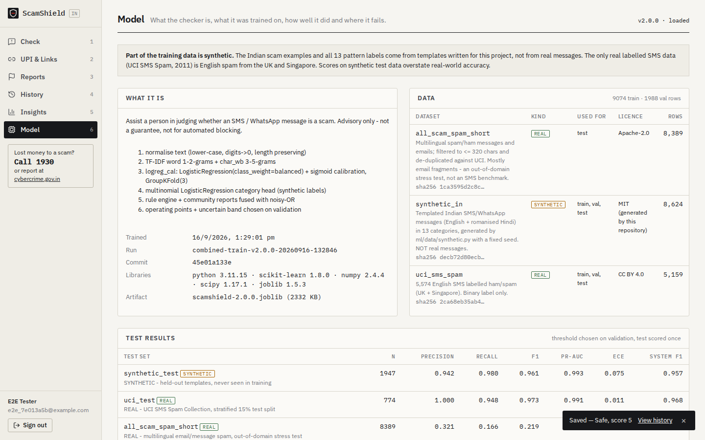
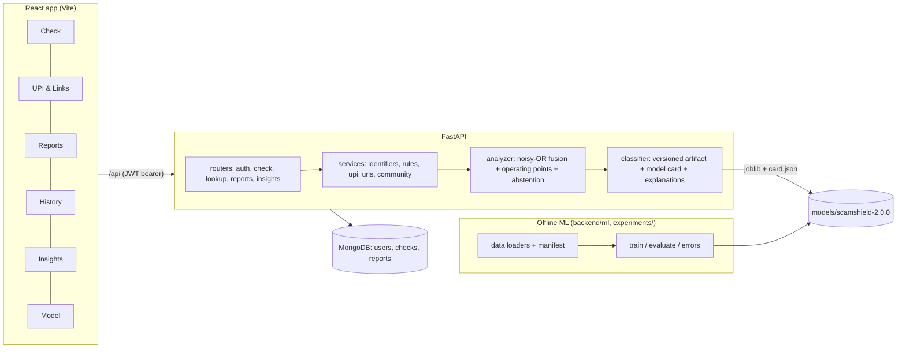
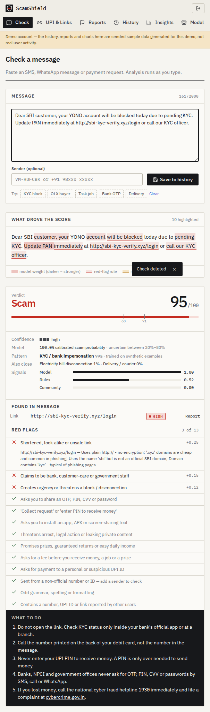

# ScamShield

ScamShield checks a suspicious Indian SMS, WhatsApp message, UPI ID or payment link and explains its verdict. It combines a calibrated text classifier, a red-flag rule engine and community reports.

**Stack:** React + TypeScript (Vite) · FastAPI · MongoDB · scikit-learn

> **Data honesty note.** The Indian scam examples used for training, and all 13 scam-pattern labels, are **synthetic** (generated from templates in this repo). The only real labelled data is English SMS spam from the UK and Singapore (UCI). A model trained only on the synthetic data scores F1 0.99 on synthetic test messages but **0.25 on real SMS**. See [Results](#results).

## Demo


| Model card | Insights (demo account, seeded data) |
|---|---|
|  |  |

## Problem

- Indian phone users get a steady stream of fraud messages: fake KYC and "account blocked" SMS, UPI "collect requests" dressed up as refunds, task-based job scams, fake electricity-disconnection notices, OTP-harvesting calls.
- Most victims lose money because they act within minutes: they click a link, share an OTP, or enter a UPI PIN "to receive money".
- A person needs a quick second opinion that explains **why** a message looks risky and what to do next.

## Solution

Paste a message and ScamShield returns:
- a **0–100 risk score** and a verdict (**Safe / Suspicious / Scam**), or an explicit **"Insufficient confidence"** when it should not decide
- the **calibrated probability** from the model and a confidence level
- the likely **scam pattern** (13 classes, trained on synthetic labels)
- the **phrases that drove the score**, highlighted in the message
- a **red-flag checklist** (asks for OTP/PIN, collect request, look-alike links, non-official sender, …)
- concrete **advice**, including the national cyber-fraud helpline **1930** and cybercrime.gov.in

The app also has a UPI ID / `upi://` link / URL checker, community fraud reports, history, and a model card page.

## Architecture



## AI/ML Pipeline

| Step | Code | What happens |
|---|---|---|
| 1. Input | `app/schemas.py` | Text of 1–2,000 characters plus an optional sender ID. The request body is capped at 64 KB. |
| 2. Preprocessing | `ml/preprocess.py` | Lower-case, every digit → `0`. The normaliser is **length-preserving**, so explanation offsets map back to the original text. Input-quality signals are computed: word count, non-Latin script ratio, URL ratio. |
| 3. Features | `ml/features.py` | TF-IDF word 1–2-grams (12k) + char_wb 3–5-grams (20k) |
| 4. Model | `ml/models.py` | LogisticRegression (`class_weight=balanced`) with sigmoid calibration over **GroupKFold(3)** by template. A multinomial LogisticRegression gives the 13-way pattern. |
| 5. Rules and reports | `app/services/rules.py`, `community.py` | 8 text rules plus link, UPI and sender checks. The community factor is the number of distinct users who reported an identifier in the message. |
| 6. Post-processing | `app/services/analyzer.py` | Noisy-OR fusion into a risk score. Cut-offs come from the **model card**. Safety-floor rules apply. |
| 7. Confidence / abstention | `analyzer.py` | Calibrated probability, confidence level, and `insufficient_confidence` when the input is too short, mostly non-Latin, mostly a link, or the model is in its validation-chosen uncertain band with no supporting evidence |
| 8. Explanation | `app/services/classifier.py` | Coefficient × tf-idf per n-gram, spread over the characters it covers, summed per word, merged into phrases |
| 9. API → UI | `routers/check.py` → `VerdictPanel.tsx` | Live analysis while typing (400 ms debounce). Inference runs in a threadpool with a timeout. |

Risk score:

```
p = calibrated model probability
R = min(0.6, Σ weights of red-flag rules that fired)
C = 0 if no identifier was reported, else min(0.65, 0.20 + 0.15·n)
risk = 100 · (1 − (1 − 0.9·p)(1 − R)(1 − C))
Safe < suspicious_score ≤ Suspicious < scam_score ≤ Scam        (v2.0.0: 60 and 71, chosen on validation)
```

Safety floor: if the message asks for an OTP/PIN, contains a collect-request/"PIN to receive" pattern, or asks you to install a remote-access app, the verdict is at least Suspicious.

Rule weights:

| Rule | Weight |
|---|---|
| asks for OTP/PIN | 0.40 |
| collect request | 0.35 |
| risky link | 0.25 / 0.15 |
| app install | 0.25 |
| threat | 0.25 |
| suspicious UPI ID | 0.20 / 0.10 |
| impersonation | 0.15 |
| non-official sender | 0.15 |
| money lure | 0.15 |
| fee first | 0.15 |
| urgency | 0.12 |
| format anomaly | 0.08 |

## Features

- **Message check:**
  - live verdict, highlighted phrases in three layers (model weight, rule hit, reported identifier)
  - red-flag checklist, advice, save to history
- **UPI & link checker:**
  - UPI ID format, known PSP handles, look-alike handles (edit distance), bait words (`refund`, `kyc`, `support`…), brand names inside personal IDs
  - URL checks: shorteners, raw IP addresses, punycode, look-alike bank/brand domains, suspicious TLDs, `http`, `.apk`
  - `upi://pay` link parsing ("this link pays *out*")
- **Community reports:**
  - one report per user per identifier (unique compound index), values normalised first
  - reported identifiers raise the score of any message that contains them
- **History:** cursor pagination; filters by verdict, category and text; expandable analysis; delete with confirmation.
- **Insights:** one `$facet` aggregation (checks per day in IST, pattern breakdown, flagged share, red-flag frequency, abstentions) plus the most-reported identifiers.
- **Model page:** the model card. Training data is tagged *synthetic* / *real*, with per-test-set metrics, baselines, decision rules and limitations.
- **Demo account:** `demo@scamshield.app` / `demo1234`. Its data is seeded, flagged `demo`, and shown with a banner.

## Tech Stack

| Layer | Choice |
|---|---|
| Frontend | React 19, TypeScript, Vite 8, react-router, recharts, lucide-react, plain CSS, IBM Plex (self-hosted); vitest + Testing Library |
| Backend | FastAPI, Pydantic v2, Motor (async MongoDB), PyJWT, bcrypt |
| ML | scikit-learn 1.8 (TF-IDF, LogisticRegression, LinearSVC, MultinomialNB, CalibratedClassifierCV), numpy, joblib |
| Tests | pytest (API, ML, robustness), vitest, Playwright (Python) end-to-end |

## Project Structure

```
backend/
  app/                  FastAPI app
    routers/            check, lookup, reports, insights (+ auth.py)
    services/           analyzer, classifier, rules, identifiers, upi, urls, community
  ml/
    data/               schema.py, synthetic.py, uci.py, scamspam.py, registry.py (manifest)
    preprocess.py  features.py  models.py  evaluate.py  errors.py  experiment.py  train.py
    templates.py        synthetic message templates + category list
  data/                 manifest.json + README (raw/ and processed/ are git-ignored)
  models/               scamshield-2.0.0.joblib (2.3 MB) + scamshield-2.0.0.card.json
  scripts/seed.py       demo account
  tests/                test_api, test_auth, test_ml, test_pipeline, test_robustness
experiments/            configs/, run.py, results/<run_id>/, reports/
frontend/src/           pages/, components/, lib/, test/
e2e/                    test_e2e.py, run_e2e.sh
docs/                   AUDIT.md, screenshots/
```

## Installation

### Windows (PowerShell)

You need:
- Python 3.11+
- Node 20+
- MongoDB Community Server running on `mongodb://127.0.0.1:27017`

```powershell
git clone <repo-url> scamshield
cd scamshield\backend
python -m venv .venv
.venv\Scripts\activate
pip install -r requirements-dev.txt
copy .env.example .env
python -c "import secrets; print(secrets.token_urlsafe(48))"   # paste into JWT_SECRET in .env

cd ..\frontend
npm install
```

### macOS / Linux

Same steps with these substitutions:
- `python3 -m venv .venv && source .venv/bin/activate`
- `cp .env.example .env`

## Environment Variables

Set these in `backend/.env`. See `.env.example`.

| Name | Required | Default | Purpose |
|---|---|---|---|
| `ENV` | no | `development` | `production` refuses to start with a weak `JWT_SECRET`. `development`/`test` warn and use a random ephemeral secret. |
| `JWT_SECRET` | **yes in production** | empty | HS256 signing key, ≥ 32 characters |
| `JWT_EXPIRE_MINUTES` | no | `10080` | Session length |
| `MONGO_URI` | no | `mongodb://127.0.0.1:27017` | MongoDB connection |
| `MONGO_DB` | no | `scamshield` | Database name |
| `CORS_ORIGINS` | no | `http://localhost:5173,http://127.0.0.1:5173` | Allowed browser origins |
| `MODEL_VERSION` | no | `2.0.0` | Loads `models/scamshield-<version>.joblib` + `.card.json` |
| `MODEL_DIR` | no | `backend/models` | Artifact directory |
| `INFERENCE_TIMEOUT_S` | no | `10` | Per-request analysis timeout (returns 503 when exceeded) |
| `LOGIN_MAX_ATTEMPTS` / `LOGIN_WINDOW_S` | no | `10` / `300` | Failed-login rate limit per IP + email |
| `MAX_BODY_BYTES` | no | `64000` | Request size limit |
| `LOG_LEVEL` | no | `INFO` | Access logs contain method, path, status and time only, never message text |

The frontend reads `VITE_BACKEND` (default `http://127.0.0.1:8001`), used by the Vite dev proxy.

## Running Locally

```powershell
# terminal 1
cd backend; .venv\Scripts\activate
python -m scripts.seed                          # optional demo account with 30 days of sample data
uvicorn app.main:app --port 8001 --reload       # API docs at http://127.0.0.1:8001/docs

# terminal 2
cd frontend; npm run dev                        # http://localhost:5173
```

- `GET /api/health` returns `status: degraded` if the model could not be loaded. In that state, message analysis returns 503, and link checks and reports keep working.
- Keyboard shortcuts: keys `1`–`6` switch pages when you are not typing.

## Training

```powershell
cd backend
python -m ml.data.registry     # downloads UCI (CC BY 4.0) + all-scam-spam (Apache-2.0), generates synthetic data, writes data/manifest.json
python -m ml.train             # trains v2.0.0 from experiments/configs/combined.json (~20 s on 2 CPUs)
```

`ml.train` does the following:
- fits on the **train** split only
- picks the model threshold, the Suspicious/Scam cut-offs and the uncertain band on **val**
- scores **test** once
- writes `models/scamshield-2.0.0.joblib`, its model card, and a full run record in `experiments/results/`

Training is deterministic: re-running it reproduced the same weights and metrics.

## Evaluation

Metrics, and why each one is used:
- **Precision / recall / F1** at an explicit, validation-chosen threshold. Accuracy is misleading at 13% spam.
- **PR-AUC**, which is more informative than ROC-AUC under class imbalance.
- **ROC-AUC.**
- **Confusion matrix.**
- **Brier score and ECE** (15 bins, with the reliability table), because the API exposes a probability.
- **Selective accuracy and coverage** for abstention.

The three evaluation tracks:

| Track | Train + tune | Question |
|---|---|---|
| A `syn2real` | synthetic | Does training on synthetic data transfer to real SMS? |
| B `real_uci` | UCI | How good is the pipeline on real data, and does real training transfer to our scam patterns? |
| C `combined` (shipped) | synthetic + UCI | Can one model handle both? |

Every track is tested on three sets:
- `synthetic_test`: held-out templates
- `uci_test`: real, 774 SMS
- `all_scam_spam_short`: real, out-of-domain email-like text, 8,389 rows

## Experiments

```bash
python experiments/run.py --config experiments/configs/syn2real.json
```

- Each run stores `metrics.json`, `config.json`, `env.json` (git commit, library versions, dataset hashes), `summary.md` and `errors_*.csv`.
- See [experiments/README.md](experiments/README.md) for the run table.
- See [the three-track report](experiments/reports/2026-09-16-three-tracks.md) for the write-up.

## Results

All numbers come from runs on **2026-09-16** that are committed in `experiments/results/`. The model is `logreg_cal` at its validation-chosen threshold.

### Real data (UCI SMS Spam, test split, 774 messages, 96 spam)

| Trained on | P | R | F1 | PR-AUC | ECE |
|---|---|---|---|---|---|
| Majority class (A) | 0.124 | 1.000 | 0.221 | 0.124 | 0.485 |
| Rules only | 0.722 | 0.271 | 0.394 | 0.294 | – |
| **Synthetic only (A)** | 0.148 | 0.771 | **0.249** | 0.226 | 0.377 |
| UCI only (B) | 0.990 | 0.979 | 0.984 | 0.995 | 0.011 |
| Synthetic + UCI (C, shipped) | 1.000 | 0.948 | 0.973 | 0.991 | 0.011 |
| C, full system (model + rules, flagged if Suspicious or Scam) | 0.989 | 0.948 | 0.968 | – | – |

### Synthetic data (held-out templates, 1,947 messages): not evidence of real-world accuracy

| Trained on | P | R | F1 | PR-AUC |
|---|---|---|---|---|
| Rules only | 0.992 | 0.772 | 0.868 | 0.918 |
| Synthetic only (A) | 0.989 | 0.990 | 0.990 | 0.999 |
| UCI only (B) | 0.616 | 0.788 | 0.692 | 0.567 |
| Synthetic + UCI (C, shipped) | 0.942 | 0.980 | 0.961 | 0.993 |

The pattern head (13 classes, synthetic labels, shipped model) scores accuracy 0.723 and macro-F1 0.655.

### Baselines (Track C, F1 on test)

| Model | synthetic_test | uci_test |
|---|---|---|
| Majority class | 0.000 | 0.000 |
| Rules only | 0.868 | 0.394 |
| TF-IDF + MultinomialNB | 0.948 | 0.925 |
| LogReg, no class weight | 0.955 | 0.973 |
| LogReg, balanced, uncalibrated | 0.959 | 0.973 |
| **LogReg, balanced, calibrated (shipped)** | **0.961** | **0.973** |
| LinearSVC + calibration | 0.962 | 0.984 |

### Calibration (Track C, ECE)

| Set | Uncalibrated | Calibrated, template-grouped folds | Calibrated, random folds (ablation) |
|---|---|---|---|
| val | 0.062 | **0.050** | 0.123 |
| UCI test | 0.025 | **0.011** | 0.148 |
| synthetic test | 0.078 | 0.075 | 0.177 |

### Out-of-domain (all-scam-spam short, 8,389 rows)

The shipped model scores F1 0.219 and ROC-AUC 0.446, which is no better than chance. The app should not be used on email text.

### Operating points (v2.0.0, chosen on validation)

| Setting | Value |
|---|---|
| Model threshold | 0.496 |
| Suspicious | score ≥ 60 (val recall ≥ 0.95) |
| Scam | score ≥ 71 (val precision ≥ 0.97) |
| Uncertain band | p in 0.196–0.796 |

- The uncertain band gives val coverage 0.81 and selective accuracy 0.966. That is **below** the 0.98 target, and the card records this.
- On the UCI test set, the API would abstain on 6 of 774 messages. On the synthetic test set, 324 of 1,947.

## Error Analysis

These patterns come from `experiments/results/combined-train-v2.0.0-20260916-132846/errors_*.csv`.

- **False positives (synthetic test: 75)**
  - The top 25 all come from one unseen legitimate template: "Money received! Rs X from NAME (upi-id) credited to your BANK account. UPI Ref N" (p 0.69–0.83).
  - The features that push them are the digit-shape n-grams `000` / `0000` / `00000` and "account".
  - Mapping every digit to `0` makes long amounts and reference numbers look like the big amounts in scam templates. A number-length bucket would be the next thing to try.
- **False negatives (synthetic test: 25)**
  - Mostly Hinglish: "…OTP aa gaya, please bhej do jaldi" (p ≈ 0.1) and "Tumhari video mere paas hai … bhejo warna…".
  - Casual words (`do`, `mere`, `ko`) carry negative weight after training on UCI chat messages.
  - The rules catch the OTP request (safety floor → Suspicious). The Hinglish sextortion wording has no rule and is still missed.
- **UCI test: 0 false positives, 5 false negatives.** All are chatty marketing ("Will u meet ur dream partner soon? … txt HORO", "Are you unique enough?") that reads like a personal message. UCI labels this as spam; ScamShield's notion of "scam" arguably would not.

## API Documentation

Interactive docs: `http://127.0.0.1:8001/docs` (OpenAPI).

Errors come back as `{"detail": ..., "status": code}`. All routes except health, model and auth need `Authorization: Bearer <token>`.

| Method | Path | Purpose |
|---|---|---|
| POST | `/api/auth/register`, `/api/auth/login` | JWT. Login is rate-limited (429). |
| GET | `/api/auth/me` | Current user (`is_demo`) |
| POST | `/api/check/analyze` | Analyse `{text, sender?}` without saving. Returns score, verdict, **status**, **abstain_reasons**, **scam_probability**, **confidence_level**, thresholds, spans, flags, identifiers, advice. |
| POST | `/api/checks` | Analyse and save |
| GET | `/api/checks?limit&cursor&verdict&category&q` | Paginated history |
| GET / DELETE | `/api/checks/{id}` | Owner-only detail / delete |
| POST | `/api/lookup` | Phone / UPI ID / URL / `upi://` link check with a community report summary |
| POST / GET | `/api/reports` | Create a report (409 on duplicate) / list my reports |
| DELETE | `/api/reports/{id}` | Withdraw a report |
| GET | `/api/reports/top` | Most-reported identifiers (`demo_only` flag) |
| GET | `/api/insights?days=30` | Dashboard aggregation |
| GET | `/api/model` | Model card of the loaded artifact |
| GET | `/api/health` | DB + model status (`ok` / `degraded`) |

## Screenshots

| | |
|---|---|
| UPI & link checker |  |
| Mobile (375 px) |  |

All screenshots are generated by the Playwright run (`e2e/run_e2e.sh`) against the real app.

## Technical Deep Dive

**Why TF-IDF + logistic regression?**
- SMS scams are short and lexically loud ("KYC", "blocked", "collect request").
- A linear model on n-grams is strong on this kind of text, runs in about 5 ms on a CPU, fits in 2.3 MB, and is exactly explainable: coefficient × feature value is an additive contribution to the log-odds.
- A transformer would need real labelled Indian data that does not exist here. Track A shows that a stronger model trained on synthetic data would only fit the synthetic templates better.

**Why these features?**
- Word bigrams capture phrases.
- char_wb 3–5-grams are robust to typos ("immediatly"), Hinglish spelling variation, and obfuscated links (`sbi-kyc`).
- The digit → `0` normalisation generalises amounts and OTPs. The error analysis shows it also causes false positives on long legitimate amounts.

**Baselines.**
- The majority class sets the floor.
- **Rules only** shows what hand-written knowledge achieves: very precise on Indian scam patterns (P 0.99), useless on UK spam (R 0.27).
- NB and LinearSVC show that the choice of linear model matters little. LinearSVC is marginally better on UCI, but logistic regression was kept for explanation and calibration.

**Inference.**
- A regex pass extracts identifiers.
- One aggregation fetches their report counts.
- Model and rules run in a threadpool with a timeout.
- Scores are fused and the thresholds are applied.
- The model is loaded once, at startup. If it fails to load, the API reports a degraded state instead of crashing.

**Confidence.**
- Probabilities are sigmoid-calibrated. Calibration folds are **grouped by template**: with random folds, the same template sits on both sides, and calibration made ECE worse (0.123 vs 0.050 on val).
- Abstention uses cheap input checks plus a validation-chosen uncertain band. The band applies only when rules and reports are silent.

**Failure modes.**
- Wordings not in the templates.
- Hinglish threats.
- Long legitimate amounts.
- Marketing written as chat.
- Email text.
- Non-Latin scripts (the app abstains).
- Community reports can be gamed.

**Metrics that matter.**
- For "should I trust this message?", **recall on scams** at the Suspicious level (missing a scam costs money) and **precision at the Scam level** (crying wolf erodes trust). The operating points are chosen for exactly those two targets.

**Data required.**
- A labelled set of real Indian scam and legitimate SMS/WhatsApp messages, ideally with pattern labels.
- The closest candidate found (`gandharvbakshi/SMS-dataset-OTP-OTP_INTENT_Phishing`) is gated. The loader interface in `ml/data/` is ready for it.

**Scaling.**
- The model is stateless and small, so API replicas scale horizontally.
- The login rate limiter is per process and would need Redis.
- Report counts use an indexed `(kind, value)` aggregation.
- History uses `_id` cursors.

**For production.**
- Real data and periodic retraining.
- Drift monitoring on score distributions and abstention rate.
- Report moderation and reputation weighting.
- URL reputation / domain-age lookups.
- Secrets in a vault, HTTPS only, audit logging without message bodies.
- A feedback loop from user corrections.

## Limitations

- The pattern (category) head is trained only on **synthetic** labels.
- Real labelled data is generic English spam (UK/Singapore, 2011), not Indian UPI/KYC fraud, and it counts marketing as spam.
- On the validation mix, the uncertain band misses its 98% selective-accuracy target.
- English and romanised Hindi only. The app is poor on email-style text.
- The PSP handle and official-domain lists are partial and hard-coded.
- No repeated-seed variance or confidence intervals: experiment not run.

## Future Work

- Evaluate on a real labelled Indian scam SMS dataset (dataset required before evaluation).
- Number-length tokens to fix the "Money received" false positives. Hinglish threat rules.
- A small multilingual transformer (e.g. MuRIL), compared against this baseline once real data exists.
- Bootstrap confidence intervals and repeated seeds.
- Moderated, reputation-weighted community reports.

## Testing

```powershell
cd backend;  python -m pytest -q          # 56 tests: API, auth, ML inference, pipeline units, robustness/security
cd frontend; npm test                     # 14 vitest tests: verdict/abstention rendering, highlights, confirm dialog, report form, history error state
./e2e/run_e2e.sh                          # Playwright journey (needs bash: Git Bash/WSL on Windows; run `python -m playwright install chromium` once)
```

The E2E journey covers:
1. Register.
2. A KYC scam shows a live "Scam" with highlights, then save.
3. A bank OTP message shows "Safe", then save.
4. A fragment shows "Insufficient confidence".
5. A look-alike UPI ID is flagged.
6. Report a number; a message with that number shows the community flag.
7. History shows 2 checks.
8. The Insights and Model pages render.
9. The demo account shows its demo banner, and a delete goes through the confirm dialog.

CI (`.github/workflows/ci.yml`) runs pytest with a MongoDB service, then the frontend build and unit tests.

## License

MIT. See [LICENSE](LICENSE).

Dataset licences:
- UCI SMS Spam Collection: CC BY 4.0
- all-scam-spam: Apache-2.0

Neither dataset is redistributed in this repo.
